<h1 align="center">Hi 👋, I'm Terry</h1>
<h3 align="center">AI 全栈开发工程师</h3>

- 📝 [I regularly write articles on](https://2218084076.github.io/)

[//]: # (- 💬 WeChat  **TerryAIronyMan**)

- 📫 How to reach me **terrylbo@163.com**

- 📄 Know about my experiences [About](https://2218084076.github.io/about/)

<h3 align="left">Languages and Tools:</h3>

## 💻 Tech Stack

[//]: # (![Anurag's GitHub stats]&#40;https://github-stats-extended.vercel.app/api?username=2218084076\&rank_icon=github&#41;)

